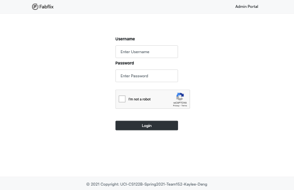
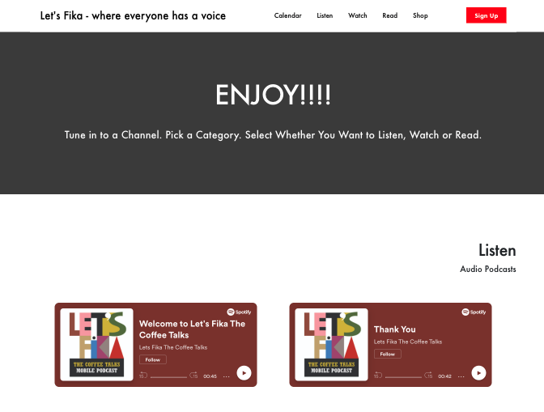
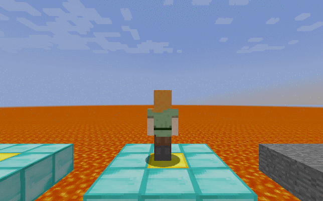
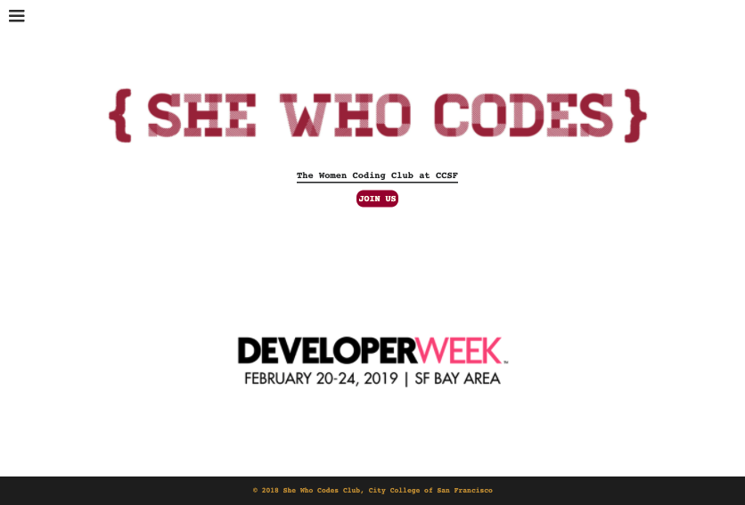
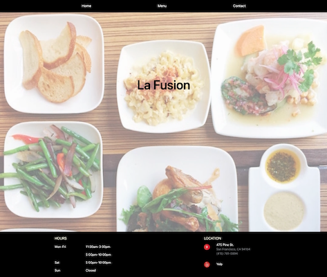

## Projects

 

---

 

#### Fabflix

Full Stack Web Application &middot; _UC Irvine, CS122B_  
<small>Apr 2021 - Jun 2021</small>

Team: Individual Work

This is an e-commerce movie shopping website(Not really selling things). The website contains separate logins for users and employees. If users wants to checkout a movie, then the user must login first. The employee dashboard is for adding more movies and stars into the database, and also the metadata of the database structure.

The backend is written in **Java Servlet**, and frontend is using **Javascript, HTML, CSS, and ajax** that's for calling the backend api. The database server used is **MySQL** and it's hosted in an AWS ec2 instance. The whole project is deployed on the **Tomcat** servers in both master and slave instance. For security reason, **reCAPTCHA** is set up to prevent bots to checkout the products and **HTTPS** is enforced. For scalability, **Master/Slave replication, load balancer, and connection pooling** were used to increase the performance of the website.

Website: [https://fabflix.shop/p5/](https://fabflix.shop/p5/)  
Software Tools: JavaServlets, MySQL, Apache Tomcat, AWS, GCP, Javascript, Java, UDF, HTTPS, JDBC, Ajax, Stored Procedures

 

---

 

#### Let’s Fika

Capstone Project &middot; _UC Irvine, CS180A/B_  
<small>Jan 2021 - Jun 2021</small>

Team Members: Albert Zhang, Jack Su, Michael Wang

This Capstone project is sponsored by a startup company that wants to provide a space for people to share perspectives during a Swedish coffee time, as known as Fika. To escape from commenting and likes and provide a healthy and safe environment for people so that speakers are more encouraged to share.

The techinical structure of the project is the **MERN** stack development, which stands for **MongoDB, ExpressJS, React, and NodeJS.** Since most of the team is more familiar with python, we decided to use **Python Flask** for the backend in the beginning. However, the connecting of backend and frontend has an unresolved bug for two weeks, so we decided to convert the whole project into NodeJS for the backend. As everyone is working for a specific feature, the team is full-stack so everyone is more familar with the project code. So, I learned React and NodeJS during this project. I am responsible for the content management for administrators and overall display control for the frontend. Since the content is hosted on Spotify and Youtube, I used **OAuth2.0** for both API calling for pulling content link into our database.

Website: [https://letsfika.today/](https://letsfika.today/)  
Software Tools: MongoDB, ExpressJS, React, NodeJS, Netlify, Heroku, Youtube Data API, Spotify API

 

---

 

#### Pixel Jump

Artificial Intelligence Project in Malmo &middot; _UC Irvine, CS175_  
<small>Oct 2020 - Dec 2020</small>

Team Members: Hongen Lei, Wencong She

Pixel Jump is a gameplay simulation in Malmo(Minecraft) that the agent will perform physical jumps from one platform to another with user-control jump simulation based on the **3D projectile motion calculation**. The purpose of this project is to let the agent observe his surrounding platforms and then pick an initial velocity from a continuous action space to ensure that the agent can land on various positions of the next platform and hopefully jump onto the glass (goal) block for greater reward.

This is **Deep Reinforcement Learning** project that uses **PPO(Proximal Policy Optimization).** The algorithm makes updates based on the transitions that were obtained by the current policy and is used in the agent’s decision for better performance. To scale up the performance of our agent, we made five difficulity maps to train our agent for at least 24 hours. Data analysis can be found in the [final report](https://bikaylee.github.io/Pixel-Jump/final.html).

Website: [https://bikaylee.github.io/Pixel-Jump/](https://bikaylee.github.io/Pixel-Jump/)  
Source Code: [https://github.com/bikaylee/Pixel-Jump](https://github.com/bikaylee/Pixel-Jump)  
Software Tools: gym, rllib, ppo, numpy

 

---

 

#### Wumpus World

Intro to Artificial Intelligence Project &middot; _UC Irvine, CS171_  
<small>Mar 2020</small>

Team: Individual Work

This project is from an intro course of Artificial Intelligence. The Wumpus World is classified as **single agent, partially observable, simulated, static, discrete, sequential, and deterministic.** The goal is to let the agent gets as many points as possible. Given a 2D grid of tiles, the agent will be scored based on the performance of getting a gold safely. The objective is to use **a\* search** to find the minimal step of path both in searching the target and returning. Based on the current perceptions to predict the safety of surrounding tiles, the agent will go to the safest location in searching and will be marked trapped and return to the starting point if surroundings are too dangerous.

Software Tools: C++, a\* search

 

---

 

#### She Who Codes

Webpage &middot; _CCSF, She Who Codes Club_  
<small>Sep 2018</small>

Team: Individual Work

As the treauser of She Who Codes club in City College of San Franciso, I redesigned the club webpage to promote our club. The webpage contains past events and upcoming events. It also includes the club contact information, meeting time, and mission.

Website: [https://bikaylee.github.io/She-Who-Codes/](https://bikaylee.github.io/She-Who-Codes/)  
Source Code: [https://github.com/bikaylee/She-Who-Codes](https://github.com/bikaylee/She-Who-Codes)  
Software Tools: HTML, CSS, Javascript

 

---

 

#### La Fusion

Webpage &middot; _San Francisco Code Ramp_  
<small>Feb 2017 - Apr 2017</small>

Team: Individual Work

Very first webpage project after taking APCS in junior year of high schoool. At San Francisco Success Center, this 8-week course about web development fundamentals was taught by an experienced software engineer. This project is a redesigned webpage for a local restaurant in San Francisco.

Website: [https://bikaylee.github.io/La-Fusion/](https://bikaylee.github.io/La-Fusion/)  
Source Code: [https://github.com/bikaylee/La-Fusion](https://github.com/bikaylee/La-Fusion)  
Software Tools: HTML, CSS, Javascript

 

---
