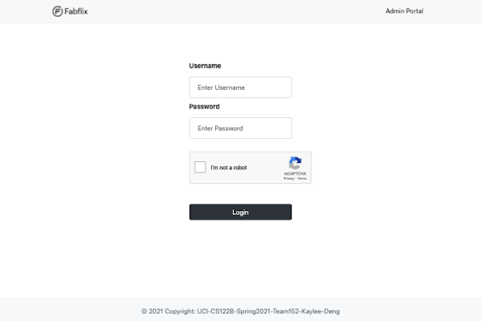
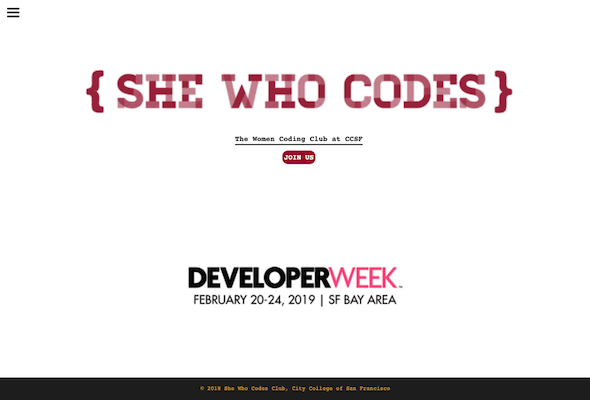

<h2> Projects </h2>

 

 

    

        

            <h3> 
                Fabflix 
            </h3>
            

                Full Stack Web Application &middot; 
                <i>
                    UC Irvine, CS122B
                </i>
                 
                <small>
                    Apr 2021 - Jun 2021
                </small>
            

            

                Team: Individual Work
            

            

                This is an e-commerce movie shopping website(Not really selling things). The website contains separate logins for users and employees. If users want to check out a movie, then the user must login first. The employee dashboard is for adding more movies and stars into the database, and also the metadata of the database structure.
            

            

                The backend is written in <b>Java Servlet</b>, and the frontend is using <b>Javascript, HTML, CSS, and ajax</b> that's for calling the backend API. The database server used is <b>MySQL</b> and it's hosted in an <b>AWS ec2</b> instance. The whole project is deployed on the <b>Tomcat</b> servers in both master and slave instances. For security reasons, <b>reCAPTCHA</b> is set up to prevent bots from checking out the products and <b>HTTPS</b> is enforced. For scalability, <b>Master/Slave replication, load balancer, and connection pooling</b> were used to increase the performance of the website.
            

            

                Website: 
                <a href="https://fabflix.shop">
                    https://fabflix.shop
                </a>
                 
                Software Tools: JavaServlets, MySQL, Apache Tomcat, AWS, GCP, Javascript, Java, UDF, HTTPS, JDBC, Ajax, Stored Procedures
            

        

    

    

            
    

 

 

    

        

            <h3> 
                Let’s Fika 
            </h3>
            

                Capstone Project &middot; 
                <i>
                    UC Irvine, CS180A/B
                </i>
                 
                <small>
                    Jan 2021 - Jun 2021
                </small>
            

            

                Team Members: Albert Zhang, Jack Su, Michael Wang
            

            

                This Capstone project is sponsored by a startup company that wants to provide a space for people to share perspectives during a Swedish coffee time, known as Fika. To escape from commenting and likes and provide a healthy and safe environment for people so that speakers are more encouraged to share.
            

            

                The technical structure of the project is the <b>MERN</b> stack development, which stands for <b>MongoDB, ExpressJS, React, and NodeJS.</b> Since most of the team is more familiar with python, we decided to use <b>Python Flask</b> for the backend in the beginning. However, the connecting of backend and frontend has an unresolved bug for two weeks, so we decided to convert the whole project into NodeJS for the backend. As everyone is working for a specific feature, the team is full-stack so everyone is more familiar with the project code. So, I learned React and NodeJS during this project. I am responsible for the content management for administrators and overall display control for the frontend. Since the content is hosted on Spotify and Youtube, I used <b>OAuth2.0</b> for both API calls for pulling content links into our database.
            

            

                Website: 
                <a href="https://letsfika.today/">
                    https://letsfika.today/ 
                </a>
                 
                Software Tools: MongoDB Atlas, ExpressJS, React, NodeJS, Netlify, Heroku, Youtube Data API, Spotify API
            

        

    

    

        
    

 

 

    

        

            <h3> 
                Pixel Jump 
            </h3>
            

                Artificial Intelligence Project in Malmo &middot; 
                <i>
                    UC Irvine, CS175
                </i>
                 
                <small>
                    Oct 2020 - Dec 2020
                </small>
            

            

                Team Members: Hongen Lei, Wencong She
            

            

                Pixel Jump is a gameplay simulation in Malmo(Minecraft) where the agent will perform physical jumps from one platform to another with user-control jump simulation based on the <b> 3D projectile motion calculation</b>. The purpose of this project is to let the agent observe his surrounding platforms and then pick an initial velocity from a continuous action space to ensure that the agent can land on various positions of the next platform and hopefully jump onto the glass (goal) block for greater reward.
            

            

                This is <b>Deep Reinforcement Learning</b> project that uses <b>PPO(Proximal Policy Optimization).</b>The algorithm makes updates based on the transitions that were obtained by the current policy and is used in the agent’s decision for better performance. To scale up the performance of our agent, we made five difficult maps to train our agent for at least 24 hours. Data analysis can be found in the 
                <a href="https://bikaylee.github.io/Pixel-Jump/final.html">
                    final report
                </a>.
            

            

                Website: 
                <a href="https://bikaylee.github.io/Pixel-Jump/">
                    https://bikaylee.github.io/Pixel-Jump/
                </a>
                 
                Source Code: 
                <a href="https://github.com/bikaylee/Pixel-Jump">
                    https://github.com/bikaylee/Pixel-Jump
                </a>
                 
                Software Tools: Python, Gym, RLlib, PPO, Numpy, OpenAI
            

        

    

    

        
    

 

 

    

        

            <h3> 
                Computer Vision Projects
            </h3>
            

                Computational Photo & Vision &middot; 
                <i>
                    UC Irvine, CS116
                </i>
                 
                <small>
                   Jan 2021 - Mar 2021
                </small>
            

            

                Team: Individual Work
            

            <h6><b>1. Images and Color Demosaicing </b></h6>
            

                The demosaiced image appears darker than the JPG version because the in the phase of demosaicing, 
                the demosaiced algrithm fills the missing pixels by prediction based on its surrounding colors 
                from the <b>RAW</b> version which this process is called <b>"interpolation"</b>. This process generates back
                the colors but not the brightness. Also, the camera senor interprets light intensity linearly 
                and the <b>Gamma/Curve</b> and <b>White Balance</b> processes in the DSP would regenerate the brightness 
                and contrast of the image for human eyes.
            

            <h6><b>2. Homography Mosaics </b></h6>
            

                In order to construct a mosaic from a central image and a set of <b>peripheral images</b>, 
                one homography for each peripheral image is requried for the final mosaic. 
                First, pick the <b>correpsonding points</b> between each central and peripheral image, the
                points should be located on distinctive locations that you can easily identify between the images
                such as high contrast corners. Then, compute the homography (3x3 transformation matrix) using 
                linear least squares. Finally, warp and blend the homographies into a mosaic image. Blending 
                is using <b>guassian filter</b> and <b>alpha blend</b> for smoother effect. 
            

            <h6><b>3. Texture Quilting </b></h6>
            

                This project is to stitch together image patches sampled from an input texture in order to synthesize 
                new texture images. First, find the shortest path of seam between the edge of 
                the image patch to reduce short stitch. Then, stitch the image from left to right and top to 
                bottom and remove the overlapping region. Finally, the text quilting step takes an array 
                containing the set of available texture tiles, the tilesize and overlap parameters and synthesizes
                the output texture by stitching together the tiles.
            

            <h6><b>4. Object Detection </b></h6>
            

                This project takes in a collection of templates and use their <b>HOG feature maps</b> to compute the
                similar objects in the image. First, compute the <b>orientation and magnitude of the gradient 
                vector</b> at each pixel. Second, get the histogram bin of gradient orientations for HOG features. 
                Then, correlate the template with the feature map, Lastly, take a collection 
                of cropped positive and negative examples of the object in detecting, extract the features 
                for each, and generate a template by taking the average positive template minus the average
                negative template.
            

            <h6><b>5. Face Morphing and Swapping </b></h6>
            

                This project is to warp from one face to another using the <b>piecewise affine warping technique</b> 
                to perform morphing and face-swapping. The idea to is transform the selected points into 
                triangles and perform morphing and blending. 
            

            

                Tools: Python, Jupyter Notebook, Numpy, Matplotlib, Scipy
            

        

    

    

            
    

 

 

    

        

            <h3> 
                Embedded Software built with ATMega32
            </h3>
            

                Embedded Software Projects &middot; 
                <i>
                    UC Irvine, CS145/L
                </i>
                 
                <small>
                   Jan 2020 - Mar 2020
                </small>
            

            

                Team Members: Nigina Pulatova
            

            <h6><b>1. LED Light </b></h6>
            

                A push button is used as input and an LED light as ouptut. This program blinks 
                the LED on/off for as long as the push button is pressed. Initially, instruction timing is 
                used to control the LED on/off rate (the internal 1MHz clock). Then, the timing is revised
                based on one of the ATMega32 internal timers (external 8MHz crystal). 
                The blinking rate is 500ms on and 500ms off.
            

            <h6><b>2. Clock </b></h6>
            

                A digital clock, showing MM/DD/YYYY on the top row 
                and HH:MM:SS on the bottom row. <b>Ticking</b> is included to 
                simulate each increment of second. The time can be set to 
                military time or 12hr mode. Similar to a real clock, the time
                can be modified and also includes daylight savings and leap year. 
            

            <h6><b>3. Music Player </b></h6>
            

                A keypad as input to switch between songs and an LCD and a speaker as output. 
                The music player is able to play musical notes that are stored in its memory. The frequency 
                of notes from C4 to A6 and the duration of whole, half, quarter, eighth note are predefined 
                as macros. In order to play the song, the <b>pitch, period, and tempo</b> are tuned and can be adjusted
                with keypad input.
            

            

            <h6><b>4. Voltmeter </b></h6>
                A keypad and an <b>analog-to-digital (AD) I/O</b> is used as input and 
                an LCD as output. Final display includes instantaneous voltage, max/min voltage, 
                and average voltage with a reset button. All samples are taken in every 500ms. 
                We include both <b>single-ended</b> and <b>differential</b> measurement in this project. 
            

            <h6><b>5. Alarm Clock </b></h6>
            

                The alarm clock is able to go off during the set time, 
                include stopwatch and timer, take into account the daylight savings 
                as well as switch between the world clocks and/or keep <b>ticking</b> 
                while alarm is going off. Sound is using analog audio signal.
            

            

                Tools: C, Atmel Studio, Aruino Programmer, ATMega32 Microcontroller, Keypad, LED Light, Speaker, LCD
            

        

    

    

            
    

 

 

    

        

            <h3> 
                Wumpus World 
            </h3>
            

                Intro to Artificial Intelligence Project &middot; 
                <i>
                    UC Irvine, CS171
                </i>
                 
                <small>
                    Mar 2020
                </small>
            

            

                Team: Individual Work
            

            

                This project is from an intro course of Artificial Intelligence. The Wumpus World is classified as <b>single agent, partially observable, simulated, static, discrete, sequential, and deterministic.</b> The goal is to let the agent get as many points as possible. Given a 2D grid of tiles, the agent will be scored based on the performance of getting a gold safely. The objective is to use <b>A* search</b> to find the minimal step of path both in searching the target and returning. Based on the current perceptions to predict the safety of surrounding tiles, the agent will go to the safest location in searching and will be marked trapped and return to the starting point if surroundings are too dangerous.
            

            

                Software Tools: C++, A* search
            

        

    

    

            
    

 

 

    

        

            <h3>
                She Who Codes 
            </h3>
            

                Webpage &middot; 
                <i> 
                    CCSF - She Who Codes Club 
                </i> 
                 
                <small>
                    Sep 2018
                </small>
            

            

                Team: Individual Work
            

            

                As the treasurer of She Who Codes club in City College of San Francisco, I redesigned the club webpage to promote our club. The webpage contains past events and upcoming events. It also includes the club contact information, meeting time, and mission.
            

            

                Website: 
                <a href="https://bikaylee.github.io/She-Who-Codes/">
                    https://bikaylee.github.io/She-Who-Codes/
                </a>
                 
                Source Code: 
                <a href="https://github.com/bikaylee/She-Who-Codes">
                https://github.com/bikaylee/She-Who-Codes
                </a>
                 
                Software Tools: HTML, CSS, Javascript
            

        

    

    

        
    

 

 

    

        

            <h3> 
                La Fusion 
            </h3>
            

                Webpage &middot; 
                <i>
                    San Francisco Code Ramp
                </i>  
                 
                <small>
                    Feb 2017 - Apr 2017
                </small>
            

            

            Team: Individual Work
            

            

                Very first webpage project after taking APCS in junior year of high school. At San Francisco Success Center, this 8-week course about web development fundamentals was taught by an experienced software engineer. This project is a redesigned website for a local restaurant in San Francisco.
            

            

                Website: 
                <a href="https://bikaylee.github.io/La-Fusion/">
                    https://bikaylee.github.io/La-Fusion/
                </a> 
                 
                Source Code: 
                <a href="https://github.com/bikaylee/La-Fusion">
                    https://github.com/bikaylee/La-Fusion
                </a>
                 
                Software Tools: HTML, CSS, Javascript
            

        

    

    

        
    

 

